# Manufacturing Workflow Control Dashboard

A modern, role-based manufacturing workflow management system built with React, TypeScript, and Tailwind CSS. Designed for factory floor operations with intuitive interfaces for different station roles.

## 🚀 Quick Start

### Installation

```bash
npm install
```

### Development Server

```bash
npm run dev
```

The app will start at `http://localhost:5173/` (or another available port).

### Build

```bash
npm run build
```

## 📋 Features

- **Role-Based Access Control** - Different interfaces for Operators, QC Leads, Shipping, and Supervisors
- **Real-Time Workflow Tracking** - Monitor items through Saw → Thread → CNC → QC → Ship pipeline
- **Barcode Scanning** - Scan item IDs to quickly access work items
- **Hold Management** - Place items on hold with reasons for quality issues
- **Audit Trail** - Complete history of who did what and when
- **Supervisor Oversight** - Supervisors can view all station tabs and monitor operations
- **Responsive Design** - Works seamlessly on desktop and tablet interfaces

## 🎯 How to Use the App

### 1. Login & Station Selection

When you first open the app, you'll see the **Login Page** with four large role cards:

- **Operator** (Blue) - Machine operations and assembly
- **QC Lead** (Purple) - Quality control and inspection
- **Shipping** (Green) - Warehouse and shipment management
- **Supervisor** (Orange) - Floor management and oversight

**To log in:** Click on your role card to start your shift. You'll be logged in as a demo user for that role.

### 2. Dashboard Interface

After logging in, you'll see the **Dashboard** with:

- **Sidebar (Left)** - Navigation and user info
  - Shows your name, role, and station assignment
  - Navigation tabs (role-specific, or all tabs if Supervisor)
  - System status indicator

- **Header (Top)** - Tools and account management
  - Page title and current date
  - **Scan Item** button (Ctrl+K) - Quick barcode scanner
  - Notifications bell
  - User menu with **Logout** button to switch stations

- **Main Content Area** - Role-specific workflow interface

### 3. Operator View

**For machine operators working at assembly stations:**

1. **Pending Items Section** - Shows work items waiting to be started
2. **Select an Item** - Click on an item card to view details
3. **Workflow Actions:**
   - **Start Step** - Begin working on the item
   - **Complete Step** - Mark the current step as finished (item automatically advances)
   - **Place on Hold** - Temporarily pause work with a hold reason:
     - Material Defect
     - Dimension Error
     - Machine Issue
     - Surface Finish
     - Documentation Missing
     - Customer Request
   - **Release Hold** - Resume work on held items
   - **Send to Rework** - Return item to previous step for corrections

4. **View History** - Click the History icon to see complete audit trail for an item

### 4. QC (Quality Control) View

**For quality inspectors:**

1. **Items Awaiting QC** - Shows items ready for quality inspection
2. **Inspect Items** - Review item details and audit history
3. **QC Actions:**
   - **Pass QC** - Item passes quality check and advances to shipping
   - **Fail QC** - Item fails inspection with a hold reason
   - **Place on Hold** - Hold for further review

### 5. Shipping View

**For warehouse and shipping staff:**

1. **Items Ready to Ship** - Shows completed items pending shipment
2. **View Item Details** - Confirm order info, item specs, and destination
3. **Shipping Actions:**
   - **Ship Item** - Mark item as shipped and complete the workflow
   - **Place on Hold** - Hold shipment if needed

### 6. Supervisor View

**For floor managers and supervisors:**

1. **View All Stations** - Access all four tabs (Operator, QC, Shipping, Supervisor)
2. **Monitor Operations** - Switch between tabs to oversee different stations
3. **Key Metrics** - See:
   - Total items in workflow
   - Items on hold by reason
   - Bottlenecks and delays
   - Operator performance and audit trails

4. **Supervisor Actions:**
   - **Release holds** across any station
   - **Rework items** to resolve issues
   - **View complete audit history** with operator names and timestamps

### 7. Barcode Scanning

**Quick item lookup:**

- Press **Ctrl+K** (Windows/Linux) or **Cmd+K** (Mac) to open the scanner
- Type an item ID or name to search
- Click a suggestion or press Enter to scan
- Use the **Mock Scan** button (🎲) to randomly scan items for testing

### 8. Audit History

Every action in the system is tracked:

- **Who** - Operator's name
- **What** - Action taken (Started, Completed, Placed on Hold, etc.)
- **When** - Exact timestamp
- **Why** - Notes or hold reasons
- **Where** - Current workflow step

Click the **History** icon on any item to see the complete trail.

### 9. Switching Stations

**To switch to a different role:**

1. Click the **Logout** button (🚪) in the top-right corner
2. You'll return to the **Login Page**
3. Click a different role card to start as that user

## 🔄 Workflow Pipeline

Items flow through the manufacturing pipeline:

```
Pending → Saw → Thread → CNC → QC → Ship → Complete
```

Each step can be:
- ✅ **Started** - Operator begins work
- ✅ **Completed** - Step finished, item advances
- ⏸️ **On Hold** - Paused for quality issues or other reasons
- 🔄 **Rework** - Sent back to fix issues

### State Machine Diagram

```mermaid
%%{init: {'theme': 'dark', 'themeVariables': { 'primaryColor': '#3b82f6', 'primaryTextColor': '#fff', 'primaryBorderColor': '#60a5fa', 'lineColor': '#6b7280', 'secondaryColor': '#1f2937', 'tertiaryColor': '#374151', 'background': '#111827', 'mainBkg': '#1f2937', 'nodeBorder': '#4b5563', 'clusterBkg': '#1f2937', 'clusterBorder': '#4b5563', 'titleColor': '#f3f4f6', 'edgeLabelBackground': '#1f2937'}}}%%

flowchart TD
    subgraph SCANNER["🔍 INTELLIGENT SCANNER"]
        direction TB
        SCAN[/"📷 Barcode Scanned"/]
        SCAN --> CHECK_EXISTS{Item Exists?}

        CHECK_EXISTS -->|No| NEW_ITEM["🆕 NEW ITEM DETECTED"]
        NEW_ITEM --> INTAKE_MODAL["📝 Intake Modal"]
        INTAKE_MODAL --> ORDER_CHECK{Order ID Provided?}
        ORDER_CHECK -->|Yes - Valid| LINK_ORDER["✅ Link to Order"]
        ORDER_CHECK -->|Yes - Invalid| CREATE_PLACEHOLDER["⚠️ Create Placeholder Order"]
        ORDER_CHECK -->|No| GENERAL_STOCK["📦 General Stock"]
        LINK_ORDER --> INIT_SAW
        CREATE_PLACEHOLDER --> INIT_SAW
        GENERAL_STOCK --> INIT_SAW
        INIT_SAW["Initialize at Saw Station"]

        CHECK_EXISTS -->|Yes| STATION_CHECK{Station Match?}
        STATION_CHECK -->|"✅ Match"| SELECT_ITEM["Select Item for Work"]
        STATION_CHECK -->|"⚠️ Mismatch"| MISMATCH_WARN["⚠️ STATION MISMATCH WARNING"]
        MISMATCH_WARN --> NAV_OPTION["Navigate to Correct Station?"]
        NAV_OPTION -->|Yes| NAVIGATE["🔄 Switch Station View"]
        NAV_OPTION -->|No| CONTINUE_SCAN["Continue Scanning"]
    end

    subgraph WORKFLOW["⚙️ MANUFACTURING WORKFLOW - Happy Path"]
        direction LR
        SAW["🔧 SAW\nPending → In Progress"]
        THREAD["🔩 THREAD\nPending → In Progress"]
        CNC["⚡ CNC\nPending → In Progress"]
        QC["🔍 QC\nInspection"]
        SHIP["📦 SHIP\nPacking & Dispatch"]
        COMPLETE(("✅ COMPLETED"))

        SAW -->|"completeStep()\n+ Station Validation"| THREAD
        THREAD -->|"completeStep()\n+ Station Validation"| CNC
        CNC -->|"completeStep()\n+ Station Validation"| QC
        QC -->|"passQC()\nAll Checks ✓"| SHIP
        SHIP -->|"shipItem()\n+ Station Validation"| COMPLETE
    end

    subgraph VALIDATION["🛡️ STATE MACHINE VALIDATION"]
        direction TB
        ACTION_START["Action Requested\n(startStep/completeStep/shipItem)"]
        ACTION_START --> VAL_CHECK{"operatorStation\n===\nitem.currentStep?"}
        VAL_CHECK -->|"✅ PASS"| PROCEED["Proceed with Action"]
        VAL_CHECK -->|"❌ FAIL"| VIOLATION["🚫 PROCESS VIOLATION\nLog Warning\nReturn false"]
        PROCEED --> AUDIT["📋 Record in Audit Trail\n• timestamp\n• operatorId\n• operatorName\n• operatorStation"]
    end

    subgraph EXCEPTIONS["⚠️ EXCEPTION PATHS"]
        direction TB
        QC_INSPECT["QC Inspection"]
        QC_INSPECT --> QC_DECISION{Pass or Fail?}

        QC_DECISION -->|"❌ Fail"| QC_HOLD["🛑 QC HOLD\nReason Required"]
        QC_HOLD --> HOLD_STATE["Item.onHold = true\nItem.holdReason = reason"]
        HOLD_STATE --> BLOCKED["🚫 SHIPMENT BLOCKED\ncanShipItem() → false"]

        HOLD_STATE --> RELEASE_OR_REWORK{Supervisor Decision}
        RELEASE_OR_REWORK -->|"Release Hold"| RELEASE["✅ Release from Hold\nResume at QC"]
        RELEASE_OR_REWORK -->|"Rework Required"| REWORK["🔄 SEND TO REWORK"]
        REWORK --> BACK_TO_SAW["Reset to SAW\nStatus = Pending\nClear Hold"]

        QC_DECISION -->|"✅ Pass\n(All Checklist Items)"| TO_SHIP["Advance to SHIP"]
    end

    INIT_SAW -.->|"New Item\nCreated"| SAW
    SELECT_ITEM -.->|"Ready for\nWork"| WORKFLOW
    NAVIGATE -.->|"View\nSwitched"| WORKFLOW

    BACK_TO_SAW -.->|"Rework\nCycle"| SAW
    RELEASE -.->|"Resume\nInspection"| QC

    classDef blueNode fill:#1e40af,stroke:#3b82f6,stroke-width:2px,color:#fff
    classDef greenNode fill:#065f46,stroke:#10b981,stroke-width:2px,color:#fff
    classDef redNode fill:#7f1d1d,stroke:#ef4444,stroke-width:2px,color:#fff
    classDef amberNode fill:#78350f,stroke:#f59e0b,stroke-width:2px,color:#fff
    classDef purpleNode fill:#581c87,stroke:#a855f7,stroke-width:2px,color:#fff
    classDef grayNode fill:#374151,stroke:#6b7280,stroke-width:2px,color:#fff
    classDef successNode fill:#14532d,stroke:#22c55e,stroke-width:3px,color:#fff

    class SAW,THREAD,CNC blueNode
    class QC,QC_INSPECT purpleNode
    class SHIP greenNode
    class COMPLETE successNode
    class QC_HOLD,HOLD_STATE,BLOCKED,VIOLATION redNode
    class MISMATCH_WARN,CREATE_PLACEHOLDER amberNode
    class NEW_ITEM,INTAKE_MODAL,SCAN blueNode
    class REWORK,BACK_TO_SAW amberNode
    class AUDIT,PROCEED grayNode
```



### Diagram Key

| Element | Meaning |
|---------|---------|
| 🔵 Blue nodes | Manufacturing stations (Saw, Thread, CNC) |
| 🟣 Purple nodes | QC inspection stages |
| 🟢 Green nodes | Shipping / Completed states |
| 🔴 Red nodes | Blocking conditions (Hold, Violations) |
| 🟠 Amber nodes | Warnings and rework paths |
| Dashed lines | Cross-subgraph connections |

### State Machine Rules

1. **Happy Path**: Linear progression through `WORKFLOW_STEPS` array (`Saw → Thread → CNC → QC → Ship`)
2. **Validation Gate**: Every `startStep`/`completeStep`/`shipItem` passes through station validation
3. **QC Hold Collision**: `onHold === true` blocks `canShipItem()` returning `false`
4. **Rework Loop**: Failed QC items return to Saw station with full audit trail
5. **Scanner Dual Logic**: New IDs → Intake flow, Existing IDs → Station match check

## 🛡️ Business Logic Hardening

The state machine enforces shop-floor reliability through context-level validation:

### Station Validation

```typescript
// Every workflow action validates operatorStation matches item.currentStep
if (operatorStation !== item.currentStep) {
  console.warn(`Process Violation: Station ${operatorStation} cannot complete work for ${item.currentStep}`);
  return false;
}
```

### Audit Trail Integrity

Every action records:
- `timestamp` - When the action occurred
- `operatorId` - Who performed the action
- `operatorName` - Human-readable operator name
- `operatorStation` - Where the action was performed (for forensic verification)
- `notes` - Additional context (hold reasons, rework notes)

### Order Traceability

New items scanned via intake are linked to:
- **Valid Order ID** - Linked to existing customer order (green indicator)
- **Unverified Order ID** - Creates placeholder order (amber warning shown)
- **No Order ID** - Defaults to "General Stock" order

## 📊 Demo Data

The app includes mock data with:

- 3 sample orders
- Multiple work items per order
- Different priorities and statuses
- Mock operators with realistic names
- Sample audit history entries

## 🛠 Technology Stack

- **React 19** - UI framework
- **TypeScript** - Type safety
- **Tailwind CSS** - Styling
- **React Router** - Navigation
- **Lucide React** - Icons
- **Vite** - Build tool

## 📝 Project Structure

```
src/
├── components/
│   ├── layout/           # Header, Sidebar, MainLayout
│   ├── views/            # Role-specific views (Operator, QC, Shipping, Supervisor)
│   ├── LoginPage.tsx     # Authentication UI
│   ├── WorkItemCard.tsx  # Item display component
│   └── ...
├── contexts/
│   ├── AuthContext.tsx   # Authentication state
│   └── WorkflowContext.tsx # Workflow operations
├── data/
│   └── mockData.ts       # Sample data
├── types/
│   ├── auth.ts           # Auth types
│   └── index.ts          # Workflow types
└── App.tsx               # Main app component
```

## 🎓 Tips for Best Experience

1. **Supervisors**: Log in as "Supervisor" to see all station tabs and monitor the entire floor
2. **Scan Items**: Use Ctrl+K to quickly find items without scrolling
3. **History Tracking**: Check item histories to understand what happened at each station
4. **Hold Reasons**: Always select an appropriate reason when placing items on hold
5. **Workflow Steps**: Items automatically advance - just mark them complete!

## 🚀 Development Notes

- Changes to code hot-reload automatically (HMR)
- All data is stored in React context (no backend)
- Mock data is reset on page refresh
- User sessions persist during app navigation

---

**Version 1.0** - Manufacturing Workflow Control Dashboard
